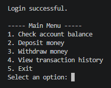
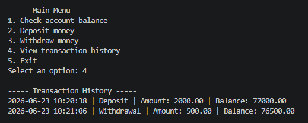

## ATM MANAGEMENT SYSTEM USING C++ 

A console-based ATM management system built with C++. The project demonstrates user authentication, account balance management, deposits, withdrawals, transaction history, file handling, and input validation through a menu-driven terminal application.

| Main Menu | Transaction History |
|:---:|:---:|
|  |  |

## Features

- User login with ID and password
- Account balance checking
- Deposit functionality
- Withdrawal functionality
- Maximum withdrawal limit validation
- Insufficient balance validation
- Transaction history with timestamps
- File-based user data storage
- File-based transaction records
- Menu-driven console interface
- Input validation for menu choices and transaction amounts

## Technology

- C++
- File handling
- Standard Template Library
- Unordered maps
- Console-based programming

## Project Structure

```text
atm-management-system/
├── README.md
├── atm_system.cpp
├── data/
│   └── users.example.txt
└── assets/
    ├── atm_terminal_screenshot1.png
    └── atm_terminal_screenshot2.png
```

## Sample User Data

The repository includes sample user data in:

```text
data/users.example.txt
```

Before running the application locally, create a copy of this file and rename it to:

```text
data/users.txt
```

Example user credentials:

```text
User ID: cameron
Password: demo123
```

## Running the Application

Navigate to the project directory:

```bash
cd cpp/atm-management-system
```

Compile the program:

```bash
g++ atm_system.cpp -o atm_system
```

Run the application:

```bash
./atm_system
```

On Windows, run:

```bash
atm_system.exe
```

## Concepts Demonstrated

- User authentication
- Conditional logic
- Loops and menu-driven programming
- Functions and modular code structure
- File input and output
- Data persistence
- Transaction logging
- Input validation