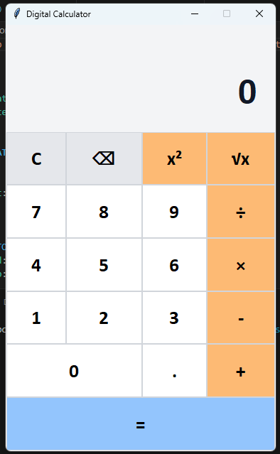
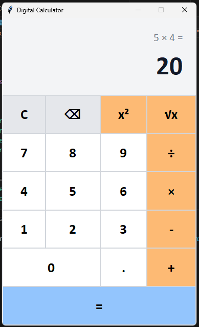

## DIGITAL CALCULATOR USING PYTHON AND TKINTER

This project demonstrates event-driven GUI development in Python through a calculator built with Tkinter. It applies object-oriented design, safe expression parsing, and input validation to create a reliable desktop application. 

| Default Interface | Calculation Result |
|:---:|:---:|
|  |  |

## Features

- Addition, subtraction, multiplication, and division
- Square and square-root calculations
- Operator-precedence support for multi-step expressions
- Mouse and keyboard input
- Backspace and clear controls
- Expression history and formatted results
- Decimal-input validation
- Division-by-zero and invalid-expression handling

## Technology

- Python
- Tkinter
- Abstract Syntax Trees (`ast`)
- Object-oriented programming

## Project Structure

```text
digital-calculator/
├── README.md
├── calculator.py
└── assets/
    └── calculator_screenshot.png
```

## Running the Application

Navigate to the project directory:

```bash
cd python/digital-calculator
```

Run the calculator:

```bash
python calculator.py
```

Python and Tkinter must be installed on the system.

## Keyboard Controls

| Key | Action |
|---|---|
| `0–9` | Enter numbers |
| `+`, `-`, `*`, `/` | Select an arithmetic operation |
| `.` | Enter a decimal point |
| `Enter` | Calculate the result |
| `Backspace` | Remove the previous character |
| `Escape` | Clear the calculator |

## Concepts Demonstrated

- Graphical user-interface development
- Class-based application design
- Event handling
- Grid-based interface layouts
- Safe arithmetic-expression parsing
- Input validation and exception handling