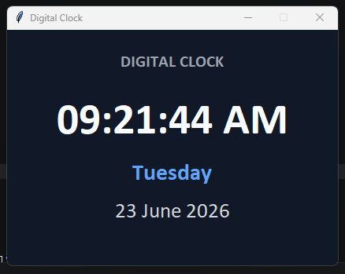

## DIGITAL CLOCK AND DATE DISPLAY USING PYTHON AND TKINTER

A desktop clock application built with Python and Tkinter. It displays the current time, weekday, and full date through a clean graphical interface that updates automatically every second.

<p align="center">
  
</p>

## Features

- Real-time digital clock display
- Current weekday display
- Full date display
- Automatic refresh every second
- Clean desktop GUI interface
- Fixed-size application window
- Object-oriented application structure

## Technology

- Python
- Tkinter
- Datetime module
- Object-oriented programming

## Project Structure

```text
digital-clock/
├── README.md
├── digital_clock.py
└── assets/
    └── digital_clock_screenshot.png
```

## Running the Application

Navigate to the project directory:

```bash
cd python/digital-clock
```

Run the application:

```bash
python digital_clock.py
```

Python and Tkinter must be installed on the system.

## Concepts Demonstrated

- Graphical user-interface development
- Event-driven programming
- Date and time formatting
- Automatic UI refresh using Tkinter's `after()` method
- Class-based application design